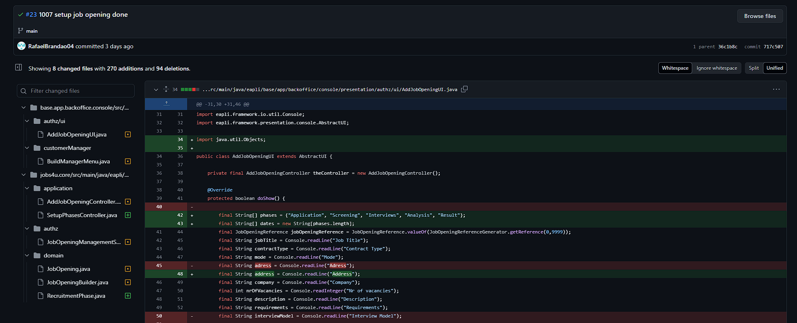

# US Example

## 1. Context

## 2. Requirements

*US Example*- 

*Acceptance Criteria:*

*Dependencies/References:*

•US Example2:

## 3. Analysis

Questions from the forum:

**Question:** 
 
**Answer:** 

## 4. Design

### 4.1. Realization
Here we have the class diagram, system sequence diagram and the sequence diagram for the Example:

### 4.2. Applied Patterns

### 4.3. Tests

Include here the main tests used to validate the functionality. Focus on how they relate to the acceptance criteria.

*Test 1:* 

## 5. Implementation/Major Commits

## 6. Integration

## 7. Demonstration

